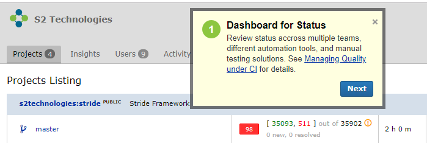

---
testspace:
---

# Images Relative
Using the following content:

<pre>

</pre>

## Case Overview
Using the following content:

<pre>
Stuff here

text here

* This
* That
</pre>

text here

* This
* That

## Step Unordered List
Using the following content:
 <pre>
Text here

* This 
* That

  

* This
* That
</pre>

Text here

* This 
* That

  

* This
* That

 
## Steps Ordered List
Using the following content:

<pre>
Text here

1. This 
3. That

  

4. This
5. That
</pre>

Text here

1. This 
3. That

  

4. This
5. That

## Nested Steps Unordered List
Using the following content:

<pre>
Text here

* This 
* That

  

* This
  * What 

   

  * Wow
* That
</pre>

Text here

* This 
* That

  

* This
  * What 

   

  * Wow
* That
 
## Nested Steps Ordered List
Using the following content:
<pre>
Text here

1. This 
2. That

  

3. This
   * What 

   

   * Wow
4. That
</pre>

Text here

1. This 
2. That

  

3. This
   * What 

   
   
   * Wow
4. That

 
